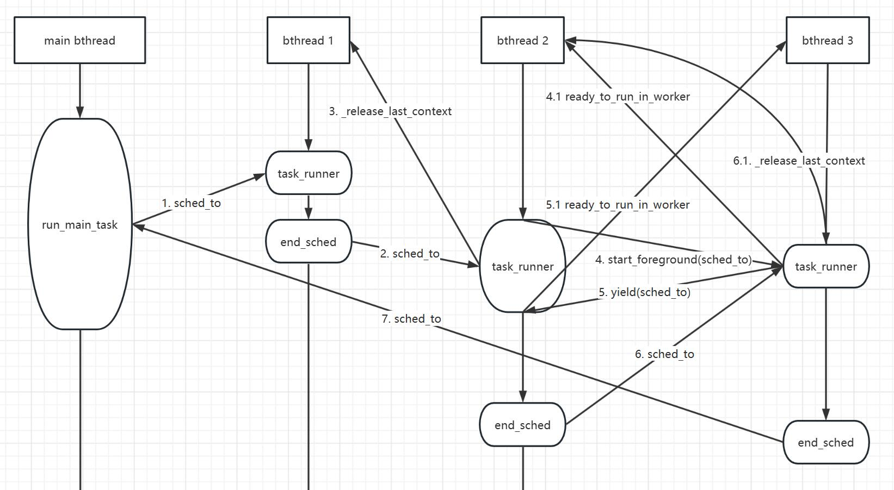

[调度执行bthread的主要数据结构](#调度执行bthread的主要数据结构)

[一个pthread调度执行私有TaskGroup的任务队列中各个bthread的过程](#一个pthread调度执行私有TaskGroup的任务队列中各个bthread的过程)

## 调度执行bthread的主要数据结构
在一个线上环境系统中，会产生大量的bthread，系统的cpu核数有限，如何让大量的bthread在有限的cpu核心上得到充分调度执行，实现全局的最大并发主要是由TaskGroup对象、TaskControl对象实现的。

1. 每一个TaskGroup对象是系统线程pthread的线程私有对象，它内部包含有任务队列，并控制pthread如何执行任务队列中的众多bthread任务。TaskGroup中主要的成员有：

   - `_remote_rq`：如果一个pthread 1想让pthread 2执行bthread 1，则pthread 1会将bthread 1的tid压入pthread 2的TaskGroup的_remote_rq队列中。
   
   - `_rq`：pthread 1在执行从自己私有的TaskGroup中取出的bthread 1时，如果bthread 1执行过程中又创建了新的bthread 2，则bthread 1将bthread 2的tid压入pthread 1的TaskGroup的_rq队列中。

   - `_main_tid` & `_main_stack`：一个pthread会在TaskGroup::run_main_task()中执行while()循环，不断获取并执行bthread任务，一个pthread的执行流不是永远在bthread中，比如等待任务时，pthread没有执行任何bthread，执行流就是直接在pthread上。可以将pthread在“**等待bthread-获取到bthread-进入bthread执行任务函数之前**”这个过程也抽象成一个bthread，称作一个pthread的“调度bthread”或者“主bthread”，它的tid和私有栈就是_main_tid和_main_stack。
   
   - `_cur_meta`：当前正在执行的bthread的TaskMeta对象的地址。
<br>
2. TaskControl对象是**全局的单例对象**，主要成员有：

   - `_pl`：ParkingLot类型的数组。ParkingLot对象用于bthread任务的等待-通知。
   
   - `_workers`：pthread线程标识符的数组，表示创建了多少个pthread worker线程，每个pthread worker线程应拥有一个线程私有的TaskGroup对象。
   
   - `_groups`：TaskGroup对象指针的数组。
   
   TaskControl和TaskGroup的内存关系如下图所示：
   
   

## 一个pthread调度执行私有TaskGroup的任务队列中各个bthread的过程
一个pthread调度执行私有TaskGroup任务队列中的各个bthread，这些bthread是在pthread上串行执行的，彼此间不会有竞争。一个bthread的执行过程可能会有三种状态：

1. bthread的任务处理函数执行完成。一个bthread的任务函数结束后，该bthread需要负责查看TaskGroup的任务队列中是否还有bthread，如果有，则pthread执行流直接进入下一个bthread的任务函数中去执行；如果没有，则执行流返回pthread的调度bthread，等待其他pthread传递新的bthread；

2. bthread在任务函数执行过程中yield挂起，则pthread去执行任务队列中下一个bthread，如果任务队列为空，则执行流返回pthread的调度bthread，等待其他pthread传递新的bthread。挂起的bthread何时恢复运行取决于具体的业务场景，它应该被某个bthread唤醒，与pthread的调度无关。这样的例子有负责向TCP连接写数据的bthread因等待inode输出缓冲可写而被yield挂起、等待Butex互斥锁的bthread被yield挂起等。

3. bthread在任务函数执行过程中可以创建新的bthread，因为新的bthread一般是优先级更高的bthread，所以pthread执行流立即进入新bthread的任务函数，原先的bthread被重新加入到任务队列的尾部，不久后它仍然可以被pthread执行。但由于work-steal机制，它不一定会在原先的pthread执行，可能会被steal到其他pthread上执行。

按照以上的原则，分析下brpc中的实现过程。

1. TaskControl创建一个pthread worker线程和其私有的TaskGroup对象时，pthread在TaskGroup::run_main_task上开启无限循环：

   ```c++
   void TaskGroup::run_main_task() {
       TaskGroup* dummy = this;
       bthread_t tid;
       // 等待一个可执行的bthread，可能从_rq中取得其他pthead压入的bthread id，
       // 也可能从其他pthread worker线程的TaskGroup中steal一个bthread id。
       while (wait_task(&tid)) {
           // 拿到一个bthread，执行流进入bthread的任务函数。
           TaskGroup::sched_to(&dummy, tid);
           // 恢复执行的开始执行点。

           // 这里有些疑问，尚不确定何种情景下会执行下面这段代码。
           if (_cur_meta->tid != _main_tid) {
               TaskGroup::task_runner(1/*skip remained*/);
           }
       }
    }
   ```

2. wait_task()函数负责等待一个bthread，如果当前没有bthread可执行，则pthread会挂起。
   ```c++
    bool TaskGroup::wait_task(bthread_t* tid) {
        do {
            if (steal_task(tid)) {
                return true;
            }
            _pl->wait(st);
        } while (true);
    }

    bool TaskGroup::steal_task(bthread_t* tid) {
        // 是否有别的pthread送来的bthread
        if (_remote_rq.pop(tid)) {
            return true;
        }

        // 尝试去别的pthread偷一个bthread
        return _control->steal_task(tid, &_steal_seed, _steal_offset);
    }

    bool TaskControl::steal_task(bthread_t* tid, size_t* seed, size_t offset) {
        const size_t ngroup = _ngroup.load(butil::memory_order_acquire);

        // NOTE: Don't return inside `for' iteration since we need to update |seed|
        bool stolen = false;
        size_t s = *seed;
        for (size_t i = 0; i < ngroup; ++i, s += offset) {
            TaskGroup* g = _groups[s % ngroup];
            if (g->_rq.steal(tid)) {
                stolen = true;
                break;
            }
            if (g->_remote_rq.pop(tid)) {
                stolen = true;
                break;
            }
        }
        *seed = s;
        return stolen;
    }

     void ParkingLot::wait(const State& expected_state) {
        // See [docs/futex.md]
        futex_wait_private(&_pending_signal, expected_state.val, NULL);
    }
   ```
3. TaskGroup::sched_to(TaskGroup** pg, bthread_t next_tid)的作用是根据将要执行的bthread的tid在O(1)时间内定位到bthread的TaskMeta对象的地址（TaskMeta是分配在ResourcePool中的，关于ResourcePool可以参考[这篇文章](resource_pool.md)），并确保bthread的私有栈空间已创建、context结构已分配，进而调用TaskGroup::sched_to(TaskGroup** pg, TaskMeta* next_meta)：
     
   ```c++
    inline void TaskGroup::sched_to(TaskGroup** pg, bthread_t next_tid) {
        // 用bthread的后32位在N个array里查找，类似操作系统的slab
        TaskMeta* next_meta = address_meta(next_tid);
        if (next_meta->stack == NULL) {
            // Get a stack in the `type' and run `task_runner' at the first time that the stack is jumped.
            // 最终是通过汇编实现的，看不懂，可以搜索 **bthread_make_fcontext**
            ContextualStack* stk = get_stack(next_meta->stack_type(), task_runner);
            if (stk) {
                next_meta->set_stack(stk);
            } else {
                // stack_type is BTHREAD_STACKTYPE_PTHREAD or out of memory,
                // In latter case, attr is forced to be BTHREAD_STACKTYPE_PTHREAD.
                // This basically means that if we can't allocate stack, run
                // the task in pthread directly.
                next_meta->attr.stack_type = BTHREAD_STACKTYPE_PTHREAD;
                next_meta->set_stack((*pg)->_main_stack);
            }
        }

        sched_to(pg, next_meta);
    }

    void TaskGroup::sched_to(TaskGroup** pg, TaskMeta* next_meta) {
        TaskGroup* g = *pg;

        // Save errno so that errno is bthread-specific.
        const int saved_errno = errno;
        void* saved_unique_user_ptr = tls_unique_user_ptr;

        // 获取当前正在执行的bthread的TaskMeta对象的地址。
        TaskMeta* const cur_meta = g->_cur_meta;
  
        // 开始切换
        // 将_cur_meta指向下一个将要执行的bthread的TaskMeta对象的指针。
        g->_cur_meta = next_meta;
        // tls_bls存储的是当前bthread的一些运行期数据（统计量等），执行切换动作前，将tls_bls的内容复制到
        // 当前bthread的私有storage空间中，再将tls_bls重新指向将要执行的bthread的私有storage。
        cur_meta->local_storage = tls_bls;
        tls_bls = next_meta->local_storage;

        if (cur_meta->stack != NULL) {
            if (next_meta->stack != cur_meta->stack) {
                // 这里真正执行bthread的切换。
                // 将执行pthread的cpu的寄存器的当前状态存入cur_meta的context中，并将next_meta的context中
                // 的数据加载到cpu的寄存器中，开始执行next_meta的任务函数。
                jump_stack(cur_meta->stack, next_meta->stack);
                // 这里是cur_meta代表的bthread的恢复执行点。
                // bthread恢复执行的时候可能被steal到其他pthread上了，需要重置TaskGroup对象的指针g。
                // probably went to another group, need to assign g again.
                g = tls_task_group;
            }
        } // else because of ending_sched(including pthread_task->pthread_task)

        while (g->_last_context_remained) {
            // 执行一些回调函数
            RemainedFn fn = g->_last_context_remained;
            g->_last_context_remained = NULL;
            fn(g->_last_context_remained_arg);
            g = tls_task_group;
        }

        // Restore errno
        errno = saved_errno;
        tls_unique_user_ptr = saved_unique_user_ptr;

        *pg = g;
    }
   ```
   
4. 一个bthread被执行时，pthread将执行TaskGroup::task_runner()，在这个函数中会去执行TaskMeta对象的fn()，即应用程序设置的bthread任务函数。task_runner()的关键代码如下：

   ```c++
    void TaskGroup::task_runner(intptr_t skip_remained) {
        TaskGroup* g = tls_task_group;

        // Meta and identifier of the task is persistent in this run.
        TaskMeta* const m = g->_cur_meta;

        // 执行应用程序设置的任务函数，在任务函数中可能yield让出cpu，也可能产生新的bthread。
        m->fn(m->arg);

        // Group is probably changed
        g = tls_task_group;

        // 任务函数执行完成后，需要唤起等待该任务函数执行结束的pthread/bthread
        butex_wake_except(m->version_butex, 0);

        // 回到sched_to的时候在执行，返还stack等
        g->set_remained(TaskGroup::_release_last_context, m);

        // 将pthread线程执行流转入下一个可执行的bthread（普通bthread或pthread的调度bthread）
        ending_sched(&g);
    }
   ```
   
   bthread任务函数结束完后会调用ending_sched()，在ending_sched()内会尝试从本地TaskGroup的任务队列中找出下一个bthread，或者从其他pthread的TaskGroup上steal一个bthread，如果没有bthread可用则下一个被执行的就是pthread的“调度bthread”，通过sched_to()将pthread的执行流转入下一个bthread的任务函数。
   ```c++
    void TaskGroup::ending_sched(TaskGroup** pg) {
        TaskGroup* g = *pg;

        // Find next task to run, if none, switch to idle thread of the group.
        bthread_t next_tid = 0;

        const bool popped = g->_rq.pop(&next_tid);
        if (!popped && !g->steal_task(&next_tid)) {
            // Jump to main task if there's no task to run.
            next_tid = g->_main_tid;
        }

        TaskMeta* next_meta = address_meta(next_tid);
        sched_to(pg, next_meta);
    }
   ```
   
5. 一个bthread在自己的任务函数执行过程中想要挂起时，调用TaskGroup::yield(TaskGroup** pg)，yield()内部会调用TaskGroup::sched(TaskGroup** pg)，sched()也是负责将pthread的执行流转入下一个bthread（普通bthread或调度bthread）的任务函数。挂起的bthread在适当的时候会被其他bthread唤醒，即某个bthread会负责将挂起的bthread的tid重新加入TaskGroup的任务队列。
   ```c++
    void TaskGroup::yield(TaskGroup** pg) {
        TaskGroup* g = *pg;
        ReadyToRunArgs args = { g->current_tid(), false };
        // ready_to_run_in_worker 会将该tid压到_rq里
        g->set_remained(ready_to_run_in_worker, &args);
        sched(pg); // 和ending_sched差不多 :）
    }
   ```
   
6. 一个bthread 1在自己的任务函数执行过程中需要创建新的bthread 2时，会调用TaskGroup::start_foreground()，在start_foreground()内完成bthread 2的TaskMeta对象的创建，并调用sched_to()让pthread去执行bthread 2的任务函数。pthread在真正执行bthread 2的任务函数前会将bthread 1的tid重新压入TaskGroup的任务队列，bthread 1不久之后会再次被调度执行。
   ```c++
    int TaskGroup::start_foreground(TaskGroup** pg,
                                    bthread_t* __restrict th,
                                    const bthread_attr_t* __restrict attr,
                                    void * (*fn)(void*),
                                    void* __restrict arg) {
        butil::ResourceId<TaskMeta> slot;
        // address_meta的关键
        TaskMeta* m = butil::get_resource(&slot);

        // 初始化
        m->fn = fn;
        m->arg = arg;

        m->local_storage = LOCAL_STORAGE_INIT;
        m->tid = make_tid(*m->version_butex, slot);
    
        TaskGroup* g = *pg;

        // 加入调度
        RemainedFn fn = ready_to_run_in_worker;
        ReadyToRunArgs args = {g->current_tid(), ...};
        g->set_remained(fn, &args);
        TaskGroup::sched_to(pg, m->tid);

        return 0;
    }
   ```

**一个pthread执行的流程图**
